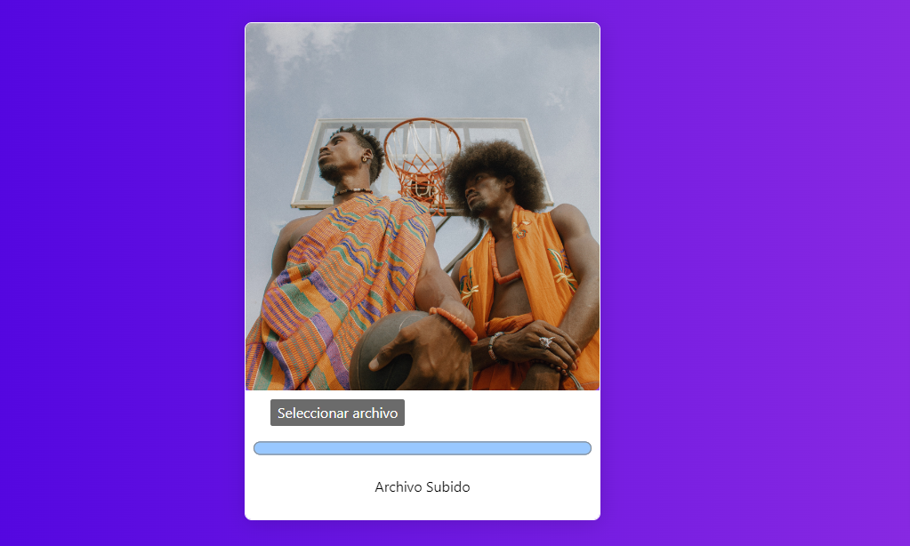

# Img app

This app is a easy implementation of a `API` of `CLOUDINARY` this `API` isuse for save images in a database external to your app

## Technologies

- HTML
- Javascript
- Boostrap

## Process of Development

Process easy and funny, it was process simple.
